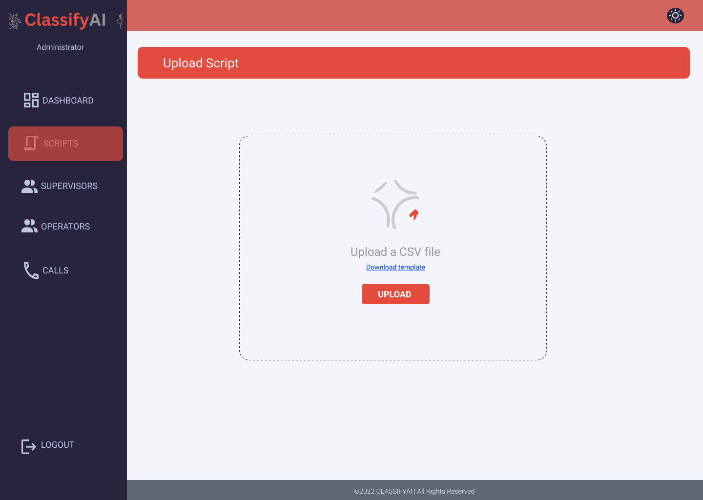

<div align="center">

> Hello world! ClassifyAI is an app that helps evaluating phone operators.

**[PROJECT PHILOSOPHY](https://github.com/jessymatta/classifyai#project-philosophy) • [WIREFRAMES](https://github.com/jessymatta/classifyai#wireframes) • [TECH STACK](https://github.com/jessymatta/classifyai#tech-stack) • [IMPLEMENTATION](https://github.com/jessymatta/classifyai#implementation) • [HOW TO RUN?](https://github.com/jessymatta/classifyai#how-to-run)**

</div>

<br><br>


>ClassifyAI is an Electron app where companies can evaluate operators' performance based on customers' satisfaction levels. 
>
> The app allows Super Supervisors to upload calls, see the sentiment analysis results of the call and download the transcribed audio with the results as an excel file. Additionally, all roles can upload excel files (stuctured according to a template that they can download) and get the analyzed results displayed in charts.

### User Stories
#### &nbsp; &nbsp; &nbsp; &nbsp; &nbsp; As a Super Supervisor:

- I want to see daily and weekly customer satisfaction analysis.
- I want to add, edit, delete and view operators and supervisors.
- I want to see a single operator profile with the calls made by this operator and the analyzed data results.
- I want to see and play all calls and download their corresponding excel file with the data.
- I want to add a call.
- I want to upload an excel file and see the displayed results in charts.

#### &nbsp; &nbsp; &nbsp; &nbsp; &nbsp; As Supervisor:

- I want to see daily and weekly customer satisfaction analysis.
- I want to see all operators profiles.
- I want to see a single operator profile with the calls made by this operator and the analyzed data results.
- I want to see and play all calls and download their corresponding excel file with the data.
- I want to upload an excel file and see the displayed results in charts.

#### &nbsp; &nbsp; &nbsp; &nbsp; &nbsp; As an Operator:

- I want to see and play all calls answered by me.
- I want the see the analyzed data of my calls.
- I want to upload an excel file and see the displayed results in charts.


<br><br>


> This design was planned before on paper, then moved to Figma app for the fine details.
Note that i didn't use any styling library or theme, all from scratch and using pure css modules.

| Login Page  | Dashboard  |
| -----------------| -----|
|  |  |

| Script Upload  |   Script Data Display  |
| -----------------| -----|
|  |  |

| Operators Actions Prototype  |   Supervisors Actions Prototype |
| -----------------| -----|
|  |  |

| Calls Prototype  |   Dark Mode |
| -----------------| -----|
|  |  |

<br><br>


Here's a brief high-level overview of the tech stack the Well app uses:

- The Project uses [React](https://reactjs.org/) with [TypeScript](https://www.typescriptlang.org/). React is a JavaScript library for building user interfaces, and TypeScript is a strongly typed programming language that is build on top of JavaScript.

- For persistent storage (database), the app uses [MySQL](https://www.mysql.com) which is an open-source relational database management system.

- To send push notifications, the app uses [Firebase](https://firebase.google.com/docs).

- To have the project as a desktop app, [ElectronJS](https://www.electronjs.org/) was used. Electron is a free and open-source software framework developed and maintained by GitHub. The framework is designed to create desktop applications using web technologies which are rendered using a flavor of the Chromium browser engine, and a backend using the Node.js runtime environment.

- As backend the project uses [Laravel framework](https://laravel.com/), which is a free and open-source PHP web framework, intended for the development of web applications following the model–view–controller architectural pattern and based on Symfony.


<br><br>


> Using the above mentioned tech stacks and the wireframes build with figma from the user stories we have, the implementation of the app is shown as below, these are screenshots from the real app

| Login Page  |
| -----------------|
| |

| Main Dashboard Supervisors  |
| -----------------|
| |

| Main Dashboard Darkmode  |
| -----------------|
| |

| Script Upload  |
| -----------------|
| |

| Script Upload Darkmode |
| -----------------|
| |

| Calls Page (Play) |
| -----------------|
| |

| Calls Page (Sentiments) |
| -----------------|
| |

| Calls Page (Generated CSV file download) |
| -----------------|
| |

| Calls Page (Associated Operator Profile) |
| -----------------|
| |

| Operators Page |
| -----------------|
| |

| Notifications |
| -----------------|
| |

<br><br>


>To get a local copy up and running follow these simple example steps.

### Prerequisites

* npm
  ```sh
  npm install npm@latest -g
  ```
* Electron
  ```
  npm install -g electron
  ```
* [Composer](https://getcomposer.org/download/)
*  Apache HTTP Server, example : [XAMPP](https://www.apachefriends.org/)

### Installation

1. Open your XAMPP control panel and start Apache and MySQL
2. Clone the repo
   ```sh
   git clone https://github.com/jessymatta/classifyai.git
   ```
3. Go to the classifyai-server folder
   ```
   cd classifyai-server
   ```
4. Install composer packages
   ```
   composer install
   ```   
5. Rename the .env.example file in the classifyai-server folder to .env and specify your database name

6. Generate a secret key generate a jwt secret key
   ```
     php artisan jwt:secret
   ```
7. Migrate the database
   ```
   php artisan migrate
   ```
8. Seed the database
   ```
   php artisan db:seed
   ```
9. Get a free API Key at [AssemblyAI](https://www.assemblyai.com/)

10. In the .env file of the classifyai-server folder paste the AssemblyAI key as follows
      ```
      ASSEMBLY_AI_TOKEN = <YOUR_SECRET_KEY>
      ```
11. Go to the classifyai-frontend folder
      ```
      cd classifyai-frontend
      ```  
12. Install the dependencies
      ```
      npm install
      ```    
13. Go to `src/constants/config.json`, and change the base urls if they do not match your laravel server IP address and port number.
      ```json
         {
            "BASE_URL": "<LARAVERL_SERVER_IP:PORT>/api/v0.1",
            "BASE_URL_CALLS": "<LARAVERL_SERVER_IP:PORT>/calls_folder",
            "BASE_URL_PP": "<LARAVERL_SERVER_IP:PORT>/images/profile_pictures"
         }
      ```
14. Go to [Firebase](https://firebase.google.com/) and create a project in Firebase console.
15. Register the project by naming it classifyai-frontend
16. Go to `src/firebase.example.js`, rename the file to `firebase.js` and replace the Firebase Configuration from the firebase website inside it with the your sender messaging id.

17. Run the start script to run react and electron simultaneously
      ```
      npm run classifyai
      ```   

Note that notifications will not work unless the app is opened in the browser as electron does not support web push notifications.